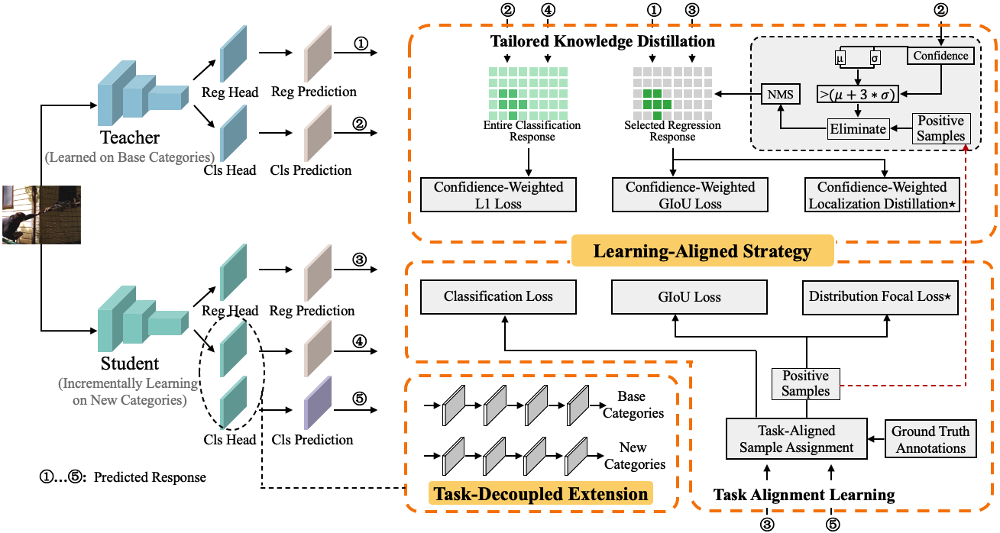

# Revisiting Class-Incremental Object Detection: An Efficient Approach via Intrinsic Characteristics Alignment and Task Decoupling

## Introduction
>In real-world settings, object detectors frequently encounter continuously emerging object instances from new classes. Incremental Object Detection (IOD) addresses this challenge by incrementally training an object detector with instances from new classes while retaining knowledge acquired from previously learned classes. Despite recent advancements, existing studies reveal a critical gap: they diverge from the inherent characteristics of dense detectors, leaving considerable room for improving incremental learning efficiency. To address this challenge, we propose a novel and efficient IOD approach that aligns more closely with the intrinsic properties of dense detectors. Specifically, our approach introduces a learning-aligned mechanism, comprising tailored knowledge distillation and task alignment learning, to achieve more efficient incremental learning. Additionally, we propose expanding the classification network through task decoupling to alleviate performance limitations stemming from different optimization goals in the incremental learning process of the classification branch. Extensive experiments conducted on the MS COCO dataset demonstrate the effectiveness of our method, achieving state-of-the-art performance across various one-step and multi-step incremental scenarios. In multi-step incremental scenarios, our approach demonstrates a significant improvement of up to 12.9% in Average Precision (AP) compared to the previous method ERD.

## Environments
- Python 3.8
- PyTorch 1.13.1
- CUDA 11.6
- mmdetection 3.0.0
- mmcv 2.0.0

The conda environment can be installed by referring to install.txt

## Usage
 - Download COCO 2017 dataset .
 - divide annotations into different incremental stages following <a href="https://github.com/Hi-FT/ERD" style="color: inherit;">ERD</a >.
 - modify the path and name of new annotations file in configs/gfl_incremental/*.py.
 - then execute the following code to incrementally train EIOD on the 40+20X setting.
#### 40+20X stage 0
    CUDA_VISIBLE_DEVICES=0 ./tools/dist_train.sh configs/gfl_increment/gfl_r50_fpn_1x_coco_fd_stage_0_tal.py 1  --work-dir=./work_dir/gfl_increment/gfl_r50_fpn_1x_coco_fd_stage_0_tal
#### 40+20X stage 1
    CUDA_VISIBLE_DEVICES=0 ./tools/dist_train.sh configs/gfl_increment/gfl_r50_fpn_1x_coco_fd_40_20X_stage_1_adg_tal.py 1  --work-dir=./work_dir/gfl_increment/gfl_r50_fpn_1x_coco_fd_40_20X_stage_1_adg_tal
#### 40+20X stage 2
    CUDA_VISIBLE_DEVICES=0 ./tools/dist_train.sh configs/gfl_increment/gfl_r50_fpn_1x_coco_fd_40_20X_stage_2_adg_tal.py 1  --work-dir=./work_dir/gfl_increment/gfl_r50_fpn_1x_coco_fd_40_20X_stage_2_adg_tal

